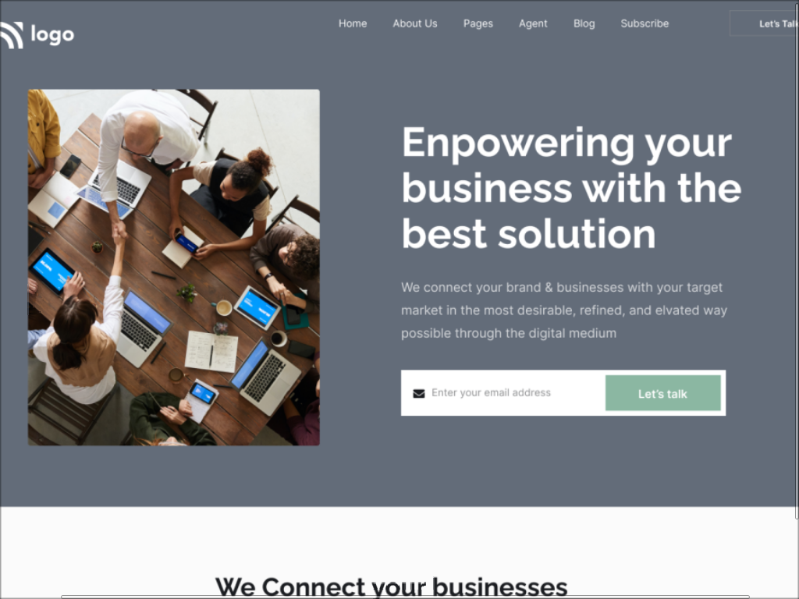

# Project 15 - with HTML and CSS

by Divesh Thakre

 

[Deployed link ](https://divesh10.netlify.app/)

## what concepts i Learned by Creating this website?

- This project was fun i used some flex-box.
- Gained confidence on css .
- learned to plan layouts.
* learned to position html elements.
* making Website Responsive

### Time Taken For this project is around 9 hrs.
